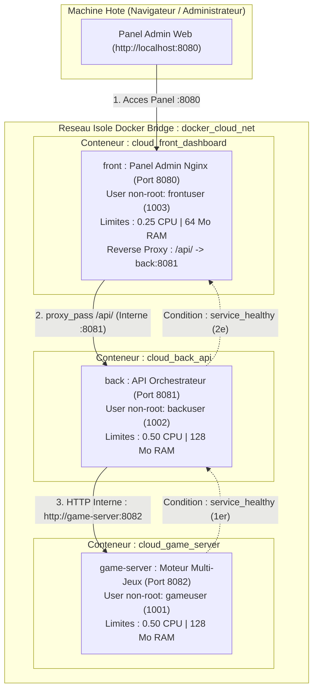

# Projet Docker Cloud - CloudGame Manager (Master 1)

Architecture virtualisee 3-tiers multi-conteneurs d'orchestration et de supervision de serveurs de jeux.

Conformement aux consignes et au bareme d'evaluation :
- **0 image issue de Docker Hub** : Toutes les images sont personnalisees via leur propre `Dockerfile` (y compris le Front Nginx, compile et configure sur Alpine).
- **3 types d'images distinctes** : 
  1. **Front-End (Nginx)** : Panel d'administration et reverse proxy supervisant l'infrastructure et les parties en direct.
  2. **Back-End (Python 3)** : API Gateway et orchestrateur routant les flux d'administration.
  3. **Serveur de Jeux (Python 3)** : Moteur de jeux multi-sessions hebergeant l'etat des parties, joueurs et scores en memoire.
- **Ressources cgroups contraintes** : Quotas stricts de CPU et de memoire alloues a chaque conteneur.
- **Arret gracieux gere** : Signaux POSIX (`SIGQUIT` pour Nginx, `SIGTERM` pour Python) sous PID 1 avec sauvegarde d'etat en memoire.
- **Ordonnancement sequentiel** : Utilisation des `healthcheck` et de `depends_on (condition: service_healthy)`.

---

## 1. Role du Fichier Mermaid (`architecture.mermaid`)

Le fichier `architecture.mermaid` contient la description textuelle formalisee du schema d'architecture selon la syntaxe **Mermaid.js**.

### A quoi sert-il ?
1. **Rendu natif sur GitHub et GitLab** :
   GitHub et GitLab interpretent nativement ce format textuel pour afficher un diagramme vectoriel clair directement dans l'interface web, sans dependre d'une image statique.
2. **Architecture as Code (Documentation versionnee)** :
   Le schema est ecrit en code brut. Toute evolution reseau ou d'allocation de ressources est historisee et lisible dans Git.
3. **Reponse directe au bareme du TP** :
   Ce fichier repond au critere *"Schema des communications /1"* exige dans le sujet.

---

## 2. Recapitulatif du Bareme et Justifications Techniques

| Critere du Bareme | Realisation Technique & Justification |
| :--- | :--- |
| **Mise en forme du rendu (/1)** | Depot Git structure, fichiers sources indentes et commentes, configuration centralisee dans `.env` et `docker-compose.yml`. |
| **Explication des dependances installees (/1)** | Base `alpine:3.20` (~7 Mo). **Front** : `nginx` (serveur web asynchrone haute performance et reverse proxy) et `curl`. **Back & Game** : `python3` (runtime natif sans module `pip` tiers) et `curl` pour les sondes `HEALTHCHECK`. Nettoyage immediat du cache apk (`rm -rf /var/cache/apk/*`). |
| **Explication des manipulations sur l'OS (/1)** | Respect strict du principe de moindre privilege : utilisateurs non-root dedies (`frontuser:1003`, `backuser:1002`, `gameuser:1001`) avec shell interactif desactive (`-s /sbin/nologin`). Pour Nginx : creation et assignation des repertoires temporaires (`/var/log/nginx`, `/tmp/client_temp`, etc.) avec droits non-root. |
| **Explication des arguments attendus (/1)** | Arguments au build (`ARG DEFAULT_PORT`) et arguments au run sous forme de variables d'environnement (`PORT`, `SERVICE_NAME`, `GAME_SERVER_URL`, `PYTHONUNBUFFERED=1`). |
| **Explications sur les entrypoints choisis (/1)** | Syntaxe **Exec Form** : `ENTRYPOINT ["nginx"]` pour le front (avec `daemon off;` dans `nginx.conf`) et `ENTRYPOINT ["python3", "app.py"]` pour le back. Les executables tournent directement en **PID 1**, sans sous-shell `/bin/sh -c`, interceptant immediatement les signaux d'arret emis par Docker. |
| **Arguments traduits dans Docker Compose (/1)** | Fichier `.env` mappe directement dans les sections `environment:`, `ports:` et `deploy.resources` de `docker-compose.yml`. |
| **Limitation des ressources de chaque conteneur (/1)** | Quotas cgroups definis dans `deploy.resources.limits` : **Front (Nginx)** : 0.25 CPU / 64 Mo RAM - **Back** : 0.50 CPU / 128 Mo RAM - **Serveur Web / Jeu** : 0.50 CPU / 128 Mo RAM. |
| **Les SIGTERM / SIGQUIT sont geres (/1)** | Nginx configure avec `STOPSIGNAL SIGQUIT` (fermeture gracieuse des workers apres traitement des requetes en cours). Les services Python capturent `SIGTERM` pour sauvegarder l'etat des sessions de jeu avant sortie propre avec exit code 0. |
| **Dependances & Ordre de demarrage (/1)** | Ordonnancement sequentiel garanti : `game-server` (Healthcheck OK) -> `back` (demarre une fois game-server `healthy`) -> `front` (demarre une fois back `healthy`). |
| **Schema des communications (/1)** | Schema vectoriel SVG (`architecture.svg`) et diagramme Mermaid ci-dessous. |

---

## 3. Schema des Communications et de l'Architecture



---

## 4. Guide d'Execution Rapide

### 1. Construire les images personnalisees
```bash
docker compose build
```

### 2. Demarrer la stack en arriere-plan
```bash
docker compose up -d
```

### 3. Acceder au Panel d'Administration
Ouvrez votre navigateur sur : [http://localhost:8080](http://localhost:8080)

Le Panel Admin permet de visualiser :
- L'etat de sante et les quotas de ressources de chaque conteneur.
- Les instances de jeux multi-sessions en cours d'execution (`PixelQuest`, `CyberArena`).
- La transmission en direct d'actions d'administration (attribution de points, enregistrement de joueurs).

### 4. Verifier les limitations de ressources cgroups
```powershell
docker inspect cloud_front_dashboard --format 'Memory={{.HostConfig.Memory}} NanoCpus={{.HostConfig.NanoCPUs}}'
docker inspect cloud_game_server --format 'Memory={{.HostConfig.Memory}} NanoCpus={{.HostConfig.NanoCPUs}}'
```

### 5. Verifier l'arret gracieux SIGTERM
```powershell
docker stop cloud_game_server
docker logs cloud_game_server --tail 5
```

### 6. Eteindre la stack
```bash
docker compose down
```
