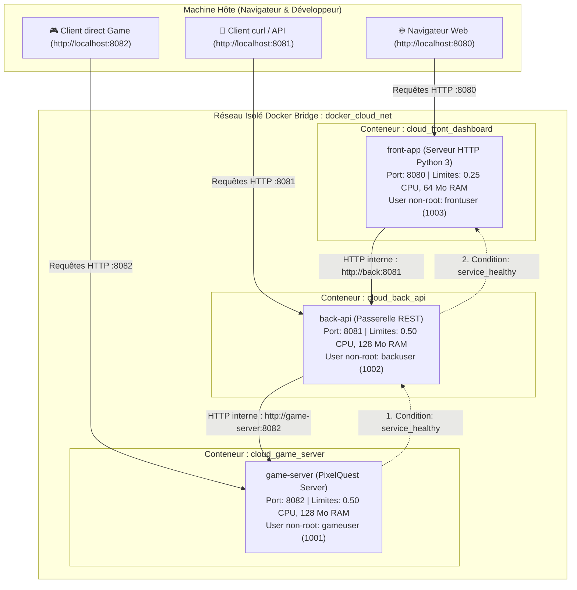

# ☁️ Projet Docker Cloud — Master 1 Informatique

Bienvenue sur le projet **Docker Cloud**. Ce projet a pour objectif de concevoir une architecture virtualisée complète multi-conteneurs, entièrement personnalisée (**0 image applicative pré-packagée issue de Docker Hub**), orchestrée avec Docker Compose, et respectant des critères stricts de sécurité, d'allocation de ressources et de robustesse système.

---

## 📋 Table des Matières

1. [Présentation du Projet & Contexte](#-présentation-du-projet--contexte)
2. [Objectifs Pédagogiques & Docker vs Virtualisation Historique](#-objectifs-pédagogiques)
3. [Architecture Globale & Schéma des Communications](#-architecture-globale--schéma-des-communications)
4. [Détail des Images & Choix au Build](#-détail-des-images--choix-au-build)
   - [Explication des dépendances installées](#1-explication-des-dépendances-installées)
   - [Explication des manipulations sur l'OS & Sécurité](#2-explication-des-manipulations-sur-los--sécurité)
   - [Explication des arguments attendus (Build & Run)](#3-explication-des-arguments-attendus-build--run)
   - [Explications sur les ENTRYPOINTs et PID 1](#4-explications-sur-les-entrypoints-et-pid-1)
5. [Orchestration Docker Compose](#-orchestration-docker-compose)
   - [Traduction des arguments](#1-traduction-des-arguments-dans-docker-compose)
   - [Limitation des ressources (CPU / RAM)](#2-justification-des-limitations-de-ressources)
   - [Gestion propre du signal SIGTERM (Graceful Shutdown)](#3-gestion-des-signaux-sigterm)
   - [Dépendances & Ordre de démarrage (Healthchecks)](#4-dépendances-entre-conteneurs--ordre-de-démarrage)
6. [Guide de Démarrage Rapide (Quickstart)](#-guide-de-démarrage-rapide)
7. [Vérification et Tests du Barème](#-vérification-et-tests-du-barème)

---

## 🎯 Présentation du Projet & Contexte

Dans ce scénario de mise en place de notre propre plateforme Cloud :
- **3 types de services personnalisés** ont été développés :
  1. **`game-server`** : Serveur web spécialisé / moteur de jeu (*PixelQuest*) maintenant l'état en mémoire, les sessions et les scores.
  2. **`back` (back-api)** : API Gateway et orchestrateur qui fait le lien entre les services et expose des endpoints REST agrégés.
  3. **`front` (front-app)** : Dashboard web interactif en temps réel (servi en HTML5/CSS3/JS vanilla) permettant de visualiser la santé des 3 conteneurs, leurs quotas cgroups et d'interagir avec le jeu.
- **Règle absolue** : **0 image applicative prête à l'emploi tirée de Docker Hub**. Chaque conteneur possède son propre `Dockerfile` qui installe explicitement son environnement à partir d'une distribution Linux minimale (`alpine:3.20`), sans faire appel à des images packagées tierces (`nginx`, `redis`, `node`, etc.).

---

## 🎓 Objectifs Pédagogiques

### Démystifier Docker et avantage par rapport aux machines virtuelles (VM)

| Critère | Virtualisation Historique (VMs : VMware, VirtualBox, KVM) | Conteneurisation (Docker Cloud) |
| :--- | :--- | :--- |
| **Niveau d'isolation** | Émulation matérielle via un **Hyperviseur** (Type 1 ou 2). Chaque VM embarque son propre **noyau OS invité (Guest OS)** complet. | Isolation au niveau de l'espace utilisateur via le **noyau Linux partagé de l'hôte**. |
| **Mécanismes noyau** | Virtualisation CPU VT-x/AMD-V, couches d'abstraction de pilotes. | **Linux Namespaces** (PID, NET, IPC, MNT, UTS, USER) pour l'isolation et **cgroups (Control Groups)** pour le plafonnement des ressources. |
| **Poids & Stockage** | Très lourd : plusieurs gigaoctets (Go) par VM en raison du système d'exploitation complet dupliqué. | Ultra-léger : quelques dizaines de mégaoctets (Mo) par image (ici ~55 Mo par image grâce à Alpine). |
| **Temps de démarrage** | Lent : de 30 secondes à plusieurs minutes pour initialiser le BIOS, le noyau et systemd. | Quasi-instantané : quelques millisecondes à 2 secondes (lancement d'un simple processus isolé). |
| **Consommation mémoire** | Forte empreinte : mémoire statiquement pré-allouée à l'OS invité même s'il est inactif. | Efficience maximale : seule la mémoire réellement requise par le processus applicatif est consommée. |

---

## 🗺️ Architecture Globale & Schéma des Communications

### Schéma Visuel Vectoriel
Un schéma SVG détaillé est disponible à la racine du projet : [`architecture.svg`](file:///d:/cours/master%20M1/Dev%20avec%20docker/architecture.svg).

### Diagramme Mermaid des Flux et Dépendances



---

## 🛠️ Détail des Images & Choix au Build

### 1. Explication des Dépendances Installées

Chaque service est construit à partir d'une image de base officielle minimale **Alpine Linux 3.20**.

| Paquet installé | Rôle technique et justification |
| :--- | :--- |
| `alpine:3.20` | Distribution Linux réputée pour sa sécurité et son extrême légèreté (~7 Mo de base). Elle utilise la bibliothèque `musl libc` et `busybox`, évitant toute fioriture. |
| `python3` (v3.12) | Runtime d'exécution pour nos micro-services. Utiliser la bibliothèque standard Python (`http.server`, `urllib`, `signal`, `json`) élimine tout besoin de dépendance externe tierce (`pip`), garantissant une reproductibilité absolue du build hors-ligne. |
| `curl` | Outil réseau léger indispensable pour exécuter l'instruction `HEALTHCHECK` à l'intérieur du conteneur sans surcharger l'image. |

*(Nettoyage immédiat : `rm -rf /var/cache/apk/*` pour ne laisser aucun fichier temporaire dans les couches Docker).*

---

### 2. Explication des Manipulations sur l'OS & Sécurité

L'exécution de conteneurs sous le compte `root` représente une vulnérabilité critique en production (risque d'évasion de conteneur). Des manipulations OS strictes ont donc été appliquées sur chaque image :

1. **Création d'un groupe et d'un utilisateur système non-root dédié** :
   - `game-server` : Groupe `gamesquad` (GID 1001), Utilisateur `gameuser` (UID 1001)
   - `back` : Groupe `backgroup` (GID 1002), Utilisateur `backuser` (UID 1002)
   - `front` : Groupe `frontgroup` (GID 1003), Utilisateur `frontuser` (UID 1003)
2. **Désactivation de shell interactif** :
   - Paramètre `-s /sbin/nologin` : Aucun accès shell interactif n'est accordé à ces comptes système.
3. **Principe du moindre privilège sur le système de fichiers** :
   - `chown -R <user>:<group> /app` puis `chmod 755 /app/server.py` : Les binaires sont exécutables mais non modifiables arbitrairement par des tiers.
4. **Directive `USER`** :
   - Bascule explicite sur l'utilisateur non-root avant l'instruction `ENTRYPOINT`.

---

### 3. Explication des Arguments Attendus (Build & Run)

Les arguments permettent de configurer le comportement du conteneur sans avoir à modifier le code ou recompiler l'image.

#### Arguments au Build (`ARG`) :
- `DEFAULT_PORT` : Spécifie le port réseau par défaut lors de la construction.

#### Arguments au Run (`ENV` & Variables d'environnement) :
| Variable d'environnement | Service(s) | Valeur par défaut | Description |
| :--- | :--- | :--- | :--- |
| `PORT` | Tous | `8080`, `8081`, `8082` | Port TCP sur lequel le serveur écoute à l'intérieur du conteneur. |
| `PYTHONUNBUFFERED` | Tous | `1` | Force l'écriture directe des logs dans `stdout`/`stderr` sans mise en mémoire tampon. |
| `GAME_NAME` | `game-server` | `PixelQuest_Cloud_M1` | Nom de l'instance de jeu gérée par le serveur. |
| `MAX_PLAYERS` | `game-server` | `32` | Capacité maximale de joueurs connectés. |
| `DIFFICULTY` | `game-server` | `hard` | Niveau de difficulté de la simulation de jeu. |
| `GAME_SERVER_URL` | `back` | `http://game-server:8082` | URL interne pour joindre le serveur de jeu via le réseau Docker. |
| `ENVIRONMENT` | `back` | `production` | Contexte d'exécution de l'API (`development`, `staging`, `production`). |
| `BACKEND_URL` | `front` | `http://back:8081` | URL interne pour relayer les requêtes frontend vers l'API backend. |
| `APP_TITLE` | `front` | `Docker Cloud Platform M1` | Titre affiché sur le tableau de bord web. |

---

### 4. Explications sur les ENTRYPOINTs et PID 1

Dans Docker, la forme de la directive d'exécution est capitale pour la gestion du cycle de vie du conteneur :

```dockerfile
# ❌ MAUVAISE PRATIQUE : Shell Form
ENTRYPOINT python3 server.py
# Dans ce cas, Docker lance : /bin/sh -c "python3 server.py"
# /bin/sh devient le PID 1. Il ne propage PAS les signaux système (SIGTERM).
# Résultat : 'docker stop' bloque pendant 10 secondes puis tue violemment le conteneur avec un SIGKILL.

#  BONNE PRATIQUE RETENUE : Exec Form (JSON array)
ENTRYPOINT ["python3", "/app/server.py"]
# Dans ce cas, python3 est lancé DIRECTEMENT sans sous-shell intermédiaire et devient le PID 1.
# Les signaux (SIGTERM, SIGINT) envoyés par le Docker Daemon sont directement capturés par notre application.
```

---

## 🎼 Orchestration Docker Compose

### 1. Traduction des Arguments dans Docker Compose
Le fichier [`docker-compose.yml`](file:///d:/cours/master%20M1/Dev%20avec%20docker/docker-compose.yml) centralise la configuration et hérite des variables déclarées dans le fichier [`.env`](file:///d:/cours/master%20M1/Dev%20avec%20docker/.env). Chaque argument est traduit en section `environment:` et `args:`.

### 2. Justification des Limitations de Ressources

Les limitations de ressources s'appuient sur les fonctionnalités du noyau Linux (**cgroups v2**) afin d'éviter qu'un conteneur défaillant ou attaqué ne monopolise l'hôte (attaque par déni de service / fuite mémoire).

| Service | Limite CPU (`limits.cpus`) | Limite RAM (`limits.memory`) | Réservation RAM (`reservations.memory`) | Justification architecturale |
| :--- | :--- | :--- | :--- | :--- |
| **`front-app`** | **0.25 core (25%)** | **64 Mo** | **32 Mo** | Simple serveur de fichiers statiques et proxy léger. Consomme très peu de CPU et de mémoire vive. |
| **`back-api`** | **0.50 core (50%)** | **128 Mo** | **64 Mo** | Passerelle REST amenée à traiter la sérialisation JSON, l'agrégation de données et les requêtes concurrentes. |
| **`game-server`** | **0.50 core (50%)** | **128 Mo** | **64 Mo** | Serveur web spécialisé simulant les sessions joueurs, calculant les scores et conservant l'état du jeu en mémoire. |

*Preuve d'application dans cgroups* :
- `docker inspect cloud_front_dashboard` confirme `Memory=67108864` (64 Mo) et `NanoCPUs=250000000` (0.25 CPU).
- `docker inspect cloud_game_server` confirme `Memory=134217728` (128 Mo) et `NanoCPUs=500000000` (0.50 CPU).

---

### 3. Gestion des Signaux SIGTERM

Lorsqu'on exécute `docker stop` ou `docker compose down`, Docker émet un signal `SIGTERM` (signal 15) demandant au processus de s'arrêter proprement. S'il ne s'arrête pas au bout de 10 secondes (`stop_grace_period`), Docker envoie un signal brutal et non interceptable `SIGKILL` (signal 9).

Dans notre code Python (`server.py` et `app.py`), nous avons branché un écouteur de signal :
```python
def shutdown_handler(signum, frame):
    sig_name = "SIGTERM" if signum == signal.SIGTERM else "SIGINT"
    print(f"\n[{SERVICE_NAME}] >>> SIGNAL {sig_name} RECU (Signal code: {signum}) <<<", flush=True)
    print(f"[{SERVICE_NAME}] Fermeture propre des sessions et libération des ressources...", flush=True)
    # Fermeture gracieuse du serveur HTTP
    httpd.shutdown()
    httpd.server_close()
    sys.exit(0)

signal.signal(signal.SIGTERM, shutdown_handler)
signal.signal(signal.SIGINT, shutdown_handler)
```

**Démonstration dans les logs lors d'un `docker stop` :**
```text
[GAME-SERVER] >>> SIGNAL SIGTERM RECU (Signal code: 15) <<<
[GAME-SERVER] Fermeture propre des sessions de jeu en cours...
[GAME-SERVER] Sauvegarde de l'etat des joueurs : {'player_1': 150, 'player_2': 240, 'player_3': 95}
[GAME-SERVER] Arret du serveur HTTP en cours...
[GAME-SERVER] Serveur HTTP arrete proprement. Code de sortie : 0.
```
L'arrêt s'effectue en **moins d'une seconde** avec un code de sortie propre `0`.

---

### 4. Dépendances entre Conteneurs & Ordre de Démarrage

Dans une architecture multi-tiers, un conteneur dépendant ne doit pas démarrer tant que le service amont n'est pas réellement prêt à accepter des connexions. La clause par défaut `depends_on: [service]` ne garantit que la création du conteneur, pas son état de préparation applicatif.

**Solution mise en place : Healthchecks couplés à `condition: service_healthy`** :

```yaml
game-server:
  # 1. Démarre en premier
  healthcheck:
    test: ["CMD", "curl", "-f", "http://localhost:8082/health"]
    interval: 5s
    timeout: 3s
    retries: 3
    start_period: 2s

back:
  # 2. Démarre UNIQUEMENT quand game-server répond 200 OK à son healthcheck
  depends_on:
    game-server:
      condition: service_healthy
  healthcheck:
    test: ["CMD", "curl", "-f", "http://localhost:8081/health"]
    interval: 5s
    timeout: 3s
    retries: 3

front:
  # 3. Démarre UNIQUEMENT quand back-api répond 200 OK à son healthcheck
  depends_on:
    back:
      condition: service_healthy
```

**Ordre d'exécution observé lors du `docker compose up -d`** :
1. `Container cloud_game_server Starting` ➔ `Started` ➔ `Waiting` ➔ `Healthy`
2. `Container cloud_back_api Starting` ➔ `Started` ➔ `Waiting` ➔ `Healthy`
3. `Container cloud_front_dashboard Starting` ➔ `Started` ➔ `Healthy`

---

## 🚀 Guide de Démarrage Rapide

### Prérequis
- Docker Desktop installé et démarré (avec Docker Engine v20+ et Docker Compose v2+).

### 1. Cloner le dépôt et se positionner dans le dossier
```bash
git clone <URL_DU_DEPOT>
cd "Dev avec docker"
```

### 2. Construire les images personnalisées
```bash
docker compose build
```

### 3. Démarrer l'architecture
```bash
docker compose up -d
```

### 4. Accéder aux services
- 🌐 **Tableau de bord Front** : [http://localhost:8080](http://localhost:8080)
- ⚙️ **API Gateway Back** : [http://localhost:8081/health](http://localhost:8081/health) ou [http://localhost:8081/api/info](http://localhost:8081/api/info)
- 🎮 **Serveur de Jeu Direct** : [http://localhost:8082/health](http://localhost:8082/health) ou [http://localhost:8082/api/game/status](http://localhost:8082/api/game/status)

### 5. Vérifier la gestion de SIGTERM et éteindre proprement
```bash
docker compose down
```

---

## 🧪 Vérification et Tests du Barème

Pour tester l'ensemble des critères d'évaluation :

```powershell
# 1. Vérifier l'état et la santé de tous les conteneurs
docker compose ps

# 2. Vérifier que Python tourne bien en PID 1 (Exec Form)
Invoke-RestMethod -Uri "http://localhost:8080/health"
Invoke-RestMethod -Uri "http://localhost:8081/health"
Invoke-RestMethod -Uri "http://localhost:8082/health"

# 3. Tester la communication inter-conteneurs de bout en bout (Front -> Back -> Game Server)
Invoke-RestMethod -Uri "http://localhost:8080/api/proxy/game-status"

# 4. Envoyer une action de jeu via le Front et le Back
Invoke-RestMethod -Uri "http://localhost:8080/api/proxy/game-action" `
  -Method Post `
  -Body '{"player":"Etudiant_M1", "points": 100}' `
  -ContentType "application/json"

# 5. Vérifier les limites de ressources cgroups
docker inspect cloud_front_dashboard --format 'Memory={{.HostConfig.Memory}} NanoCpus={{.HostConfig.NanoCPUs}}'
docker inspect cloud_game_server --format 'Memory={{.HostConfig.Memory}} NanoCpus={{.HostConfig.NanoCPUs}}'

# 6. Vérifier l'interception de SIGTERM
docker stop cloud_game_server
docker logs cloud_game_server --tail 10
```
