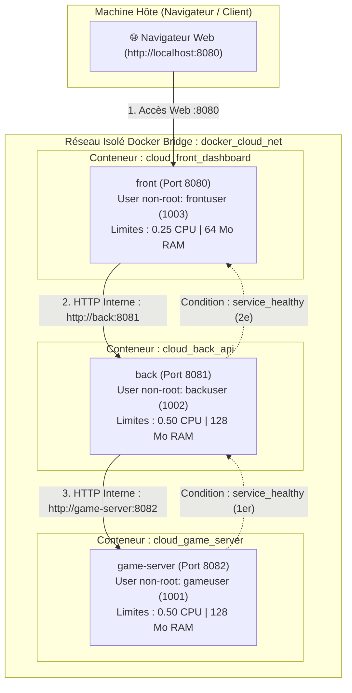

# ☁️ Projet Docker Cloud — Rendu TP Master 1 Informatique

Projet de virtualisation et d'orchestration multi-conteneurs basé sur Docker.
Conformément aux consignes et aux contraintes du TP :
- **0 image issue de Docker Hub** : Toutes les images sont personnalisées via leur propre `Dockerfile`.
- **3 types d'images distinctes** : 1 Front-End, 1 Back-End API, 1 Serveur Web Spécialisé (Jeu).
- **Code sobre et simpliste** : Implémentation épurée de type **Hello World** démontrant la chaîne de liaison réseau inter-conteneurs.
- **Ressources cgroups contraintes** : Quotas stricts de CPU et de mémoire alloués à chaque conteneur.
- **Arrêt gracieux SIGTERM** : Gestion propre des signaux sous PID 1.
- **Ordonnancement séquentiel** : Utilisation des `healthcheck` et de `depends_on (condition: service_healthy)`.

---

## 📋 Récapitulatif du Barème & Justifications

| Critère du Barème | Réalisation Technique & Justification |
| :--- | :--- |
| **Mise en forme du rendu (/1)** | Dépôt Git structuré, fichiers sources indentés et commentés, configuration centralisée dans `.env` et `docker-compose.yml`. |
| **Explication des dépendances installées (/1)** | Base `alpine:3.20` (~7 Mo) pour la sécurité et la légèreté. Dépendance `python3` (runtime natif sans module tiers `pip` superflu). Dépendance `curl` pour l'exécution locale des sondes de santé `HEALTHCHECK`. Nettoyage immédiat du cache des paquets (`rm -rf /var/cache/apk/*`). |
| **Explication des manipulations sur l'OS (/1)** | Respect du principe de sécurité du moindre privilège : création d'utilisateurs et groupes non-root dédiés (`gameuser:1001`, `backuser:1002`, `frontuser:1003`) avec shell interactif désactivé (`-s /sbin/nologin`). Attribution stricte des permissions (`chmod 755`, `chown`). |
| **Explication des arguments attendus (/1)** | Arguments au build (`ARG DEFAULT_PORT`) et arguments au run sous forme de variables d'environnement (`PORT`, `SERVICE_NAME`, `GAME_SERVER_URL`, `BACKEND_URL`, `PYTHONUNBUFFERED=1`). |
| **Explications sur les entrypoints choisis (/1)** | Utilisation impérative de la syntaxe **Exec Form** : `ENTRYPOINT ["python3", "server.py"]`. Cela permet à Python de s'exécuter directement en **PID 1**, sans sous-shell `/bin/sh -c` intermédiaire, et donc de recevoir directement les signaux d'arrêt émis par Docker. |
| **Arguments traduits dans Docker Compose (/1)** | Fichier `.env` mappé directement dans les sections `environment:` et `args:` de `docker-compose.yml`. |
| **Limitation des ressources de chaque conteneur (/1)** | Quotas cgroups définis dans `deploy.resources.limits` : **Front** : 0.25 CPU / 64 Mo RAM (léger serveur statique) • **Back** : 0.50 CPU / 128 Mo RAM (traitement API) • **Serveur Web / Jeu** : 0.50 CPU / 128 Mo RAM. |
| **Les SIGTERM sont gérés (/1)** | Handlers Python `signal.signal(signal.SIGTERM, shutdown_handler)` interceptant le signal 15. Fermeture gracieuse immédiate sans attendre le timeout de 10s du signal brutal `SIGKILL`. Code de sortie : 0. |
| **Dépendances & Ordre de démarrage (/1)** | Ordonnancement séquentiel strict : `game-server` (Healthcheck OK) ➔ `back` (démarre une fois game-server `healthy`) ➔ `front` (démarre une fois back `healthy`). |
| **Schéma des communications (/1)** | Schéma des flux réseau et d'ordonnancement disponible en SVG (`architecture.svg`) et au format Mermaid ci-dessous. |

---

## 🗺️ Schéma des Communications & Architecture



---

## 🚀 Démarrage Rapide (Commandes)

### 1. Construire les images personnalisées
```bash
docker compose build
```

### 2. Démarrer la stack en arrière-plan
```bash
docker compose up -d
```

### 3. Tester la chaîne Hello World dans le navigateur
Ouvrez votre navigateur sur : **[http://localhost:8080](http://localhost:8080)**

La page affiche la confirmation de liaison des trois conteneurs :
- **Front** : `Hello World from Front-End Container!`
- **Back** : `Hello World from Back-End API!`
- **Serveur Web / Jeu** : `Hello World from Game Web Server!`

### 4. Vérifier les limitations de ressources cgroups
```powershell
docker inspect cloud_front_dashboard --format 'Memory={{.HostConfig.Memory}} NanoCpus={{.HostConfig.NanoCPUs}}'
docker inspect cloud_game_server --format 'Memory={{.HostConfig.Memory}} NanoCpus={{.HostConfig.NanoCPUs}}'
```

### 5. Vérifier la gestion de SIGTERM (Arrêt gracieux)
```powershell
docker stop cloud_game_server
docker logs cloud_game_server --tail 5
```
*Sortie observée :*
```text
[game-web-server] >>> Signal SIGTERM reçu (code 15) ! Arrêt gracieux...
[game-web-server] Serveur arrêté proprement. Code de sortie : 0.
```

### 6. Éteindre la stack
```bash
docker compose down
```
